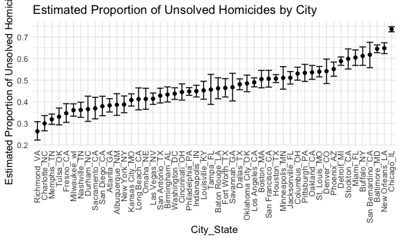
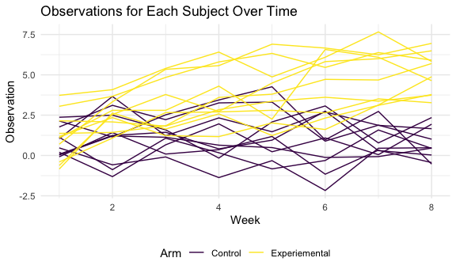
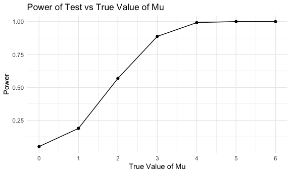
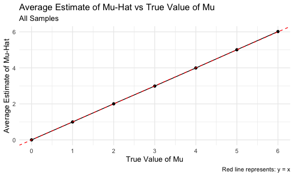
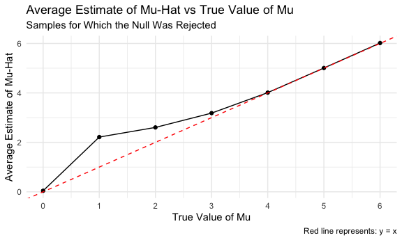

Homework 5
================
Fiona Ehrich

## Problem 1

First, I will take a look at the raw data.

``` r
homicide_df = read_csv("homicide_data/homicide-data.csv")

homicide_df
```

    ## # A tibble: 52,179 x 12
    ##    uid   reported_date victim_last victim_first victim_race victim_age
    ##    <chr>         <dbl> <chr>       <chr>        <chr>       <chr>     
    ##  1 Alb-…      20100504 GARCIA      JUAN         Hispanic    78        
    ##  2 Alb-…      20100216 MONTOYA     CAMERON      Hispanic    17        
    ##  3 Alb-…      20100601 SATTERFIELD VIVIANA      White       15        
    ##  4 Alb-…      20100101 MENDIOLA    CARLOS       Hispanic    32        
    ##  5 Alb-…      20100102 MULA        VIVIAN       White       72        
    ##  6 Alb-…      20100126 BOOK        GERALDINE    White       91        
    ##  7 Alb-…      20100127 MALDONADO   DAVID        Hispanic    52        
    ##  8 Alb-…      20100127 MALDONADO   CONNIE       Hispanic    52        
    ##  9 Alb-…      20100130 MARTIN-LEY… GUSTAVO      White       56        
    ## 10 Alb-…      20100210 HERRERA     ISRAEL       Hispanic    43        
    ## # … with 52,169 more rows, and 6 more variables: victim_sex <chr>, city <chr>,
    ## #   state <chr>, lat <dbl>, lon <dbl>, disposition <chr>

The raw dataset has 52179 rows and 12 columns. Each row corresponds to a
homicide case and provides the following information regarding the given
case: id number, date reported, victim first & last name, victim race,
victim age, victim sex, city & state, latitude & longitude, and
disposition (eg, “Closed by arrest”).

Now I will create a `city_state` variable.

``` r
homicide_df =
  read_csv("homicide_data/homicide-data.csv") %>% 
  mutate(
    city_state = str_c(city, state, sep = "_"),
    resolved = case_when(
      disposition == "Closed without arrest" ~ "unsolved",
      disposition == "Open/No arrest"        ~ "unsolved",
      disposition == "Closed by arrest"      ~ "solved"
    )
  ) %>% 
  select(city_state, resolved) %>% 
  filter(city_state != "Tulsa_AL")
```

I will now summarize within cities to obtain the total number of
homicides and the number of unsolved homicides.

``` r
aggregate_df =
  homicide_df %>% 
  group_by(city_state) %>% 
  summarize(
    hom_total = n(),
    hom_unsolved = sum(resolved == "unsolved")
  )
```

Next, I will use the `prop.test` function to estimate the proportion of
homicides that are unsolved for Baltimore, MD.

``` r
baltimore_df =
  prop.test(
    aggregate_df %>% filter(city_state == "Baltimore_MD") %>% pull(hom_unsolved),
    aggregate_df %>% filter(city_state == "Baltimore_MD") %>% pull(hom_total)
    )

baltimore_df %>% 
  broom::tidy() %>% 
  select(estimate, conf.low, conf.high)
```

    ## # A tibble: 1 x 3
    ##   estimate conf.low conf.high
    ##      <dbl>    <dbl>     <dbl>
    ## 1    0.646    0.628     0.663

Now, I will run `prop.test` for each of the cities in the dataset and
extract both the proportion of unsolved homicides and the confidence
intervals for each.

``` r
results_df =
  aggregate_df %>% 
  mutate(
    prop_tests = map2(
      .x = hom_unsolved,
      .y = hom_total,
      ~prop.test(x = .x, n = .y)
      ),
    tidy_tests = map(.x = prop_tests, ~broom::tidy(.x))
  ) %>% 
  select(-prop_tests) %>% 
  unnest(tidy_tests) %>% 
  select(city_state, estimate, conf.low, conf.high)
```

Below is a plot showing the estimates and CIs for each city.

``` r
results_df %>% 
  mutate(city_state = fct_reorder(city_state, estimate)) %>% 
  ggplot(aes(x = city_state, y = estimate)) +
  geom_point() +
  geom_errorbar(aes(ymin = conf.low, ymax = conf.high)) +
  labs(
    title = "Estimated Proportion of Unsolved Homicides by City",
    x = "City_State",
    y = "Estimated Proportion of Unsolved Homicides"
  ) +
  theme(axis.text.x = element_text(angle = 90, vjust = 0.5, hjust = 1))
```



## Problem 2

First, I will try importing one dataset.

``` r
data_1 = read_csv("./lda_data/con_01.csv")
```

Now, I will create a tidy data frame containing data from all
participants.

``` r
study_data_df =
  tibble(
    path = list.files("lda_data") # Listing all file names
    ) %>% 
  mutate(
    path = str_c("lda_data/", path), # Completing the paths
    data = map(path, read_csv) # Reading the data for each path
  ) %>% 
  unnest(data) %>% 
  mutate(
    path = str_replace(path, "lda_data/", ""),
    path = str_replace(path, ".csv", "")
    ) %>%
  separate( # Separating the path variable into arm and subject_id
    path,
    into = c("arm", "subject_id"),
    sep = "_") %>% 
  pivot_longer( # Pivoting longer so that there is only one observation per row
    week_1:week_8,
    names_to = "week",
    names_prefix = "week_",
    values_to = "observation"
  ) %>% 
  mutate( # Making sure variables are coded in appropriate classes
    arm = as.factor(arm),
    subject_id = as.factor(as.numeric(subject_id)), # Using as.numeric first just to get rid of the extra 0s
    week = as.integer(week)
    )
```

Below is a spaghetti plot showing observations for each subject over
time.

``` r
study_data_df %>% 
  mutate(unique_id = str_c(arm, subject_id, sep = "_")) %>% 
  ggplot(aes(x = week, y = observation, group = unique_id, color = arm)) +
  geom_line() +
  labs(
    title = "Observations for Each Subject Over Time",
    x = "Week",
    y = "Observation"
  ) +
  scale_color_viridis_d(name = "Arm", labels = c("Control", "Experiemental"))
```



I notice that the observations for the subjects in the experimental
group appear to increase over time, whereas the observations for the
subjects in the control group appear to remain steady over time.

## Problem 3

First, I am going to write a function.

``` r
normal_sim = function(sim_mu) {
  
  sim_data = rnorm(30, sim_mu, 5)
  
  t.test(x = sim_data, mu = 0) %>%
    broom::tidy() %>% 
    select(estimate, p.value)
  
}
```

Now, for each of the desired values of mu, I will run this function 5000
times and save the relevant outputs.

``` r
set.seed(1)

sim_results =
  tibble(sim_mu = c(0:6)) %>% 
  mutate(
    output_lists = map(.x = sim_mu, ~ rerun(5000, normal_sim(.x))),
    output_dfs = map(output_lists, bind_rows)
  ) %>% 
  select(-output_lists) %>% 
  unnest(output_dfs)
```

Below is a plot showing the proportion of times the null was rejected vs
the true value of mu.

``` r
sim_results %>% 
  group_by(sim_mu) %>% 
  summarize(power = sum(p.value < 0.05)/5000) %>% 
  ggplot(aes(x = sim_mu, y = power)) +
  geom_point() +
  geom_line() +
  scale_x_continuous(breaks = seq(0, 6, by = 1)) +
  labs(
    title = "Power of Test vs True Value of Mu",
    x = "True Value of Mu",
    y = "Power"
  )
```



I notice that, as the effect size increases, the power of the test
increases (the power ultimately plateaus close to 1). To the left of the
plateau, the shape of the curve looks bell-shaped (similar to the
left-hand side of a normal distribution).

Below is a plot showing the average estimate of mu-hat vs the true value
of mu in all samples.

``` r
sim_results %>% 
  group_by(sim_mu) %>% 
  summarize(avg_estimate = mean(estimate)) %>% 
  ggplot(aes(x = sim_mu, y = avg_estimate)) +
  geom_point() +
  geom_line() +
  scale_x_continuous(breaks = seq(0, 6, by = 1)) +
  labs(
    title = "Average Estimate of Mu-Hat vs True Value of Mu",
    subtitle = "All Samples",
    caption = "Red line represents: y = x",
    x = "True Value of Mu",
    y = "Average Estimate of Mu-Hat"
  ) +
  geom_abline(intercept = 0, slope = 1, color = "red", linetype = "dashed")
```



The sample average of mu-hat across tests is approximately equal to the
true value of mu when we consider all samples.

Below is a plot showing the average estimate of mu-hat vs the true value
of mu **only in samples for which the null was rejected**.

``` r
sim_results %>% 
  filter(p.value < 0.05) %>% 
  group_by(sim_mu) %>% 
  summarize(avg_estimate = mean(estimate)) %>% 
  ggplot(aes(x = sim_mu, y = avg_estimate)) +
  geom_point() +
  geom_line() +
  scale_x_continuous(breaks = seq(0, 6, by = 1)) +
  labs(
    title = "Average Estimate of Mu-Hat vs True Value of Mu",
    subtitle = "Samples for Which the Null Was Rejected",
    caption = "Red line represents: y = x",
    x = "True Value of Mu",
    y = "Average Estimate of Mu-Hat"
  ) +
  geom_abline(intercept = 0, slope = 1, color = "red", linetype = "dashed")
```



For mu = 0, 4, 5, and 6, the sample average of mu-hat is approximately
equal to the true value of mu. For mu = 1, 2, and 3, the sample average
of mu-hat is higher than the the true value of mu – and the magnitude of
this overestimation decreases as the true value of mu increases.

Focusing on mu = 1, 2, 3, 4, 5, and 6, my interpretation is that, since
power decreases as effect size decreases, positive results are less
likely to be “true” positives as effect size decreases. In other words,
when the true mu is lower, the estimates that are able to reach the
threshold of significance are quite high relative to the true mean,
causing an inflation of the average estimate when we only consider the
positive results. This inflation that we see dissipates as the true mean
increases.

Regarding mu = 0, I presume that the estimates that reached the
threshold of significance were distributed symmetrically about 0 and
effectively “canceled” each other out.
